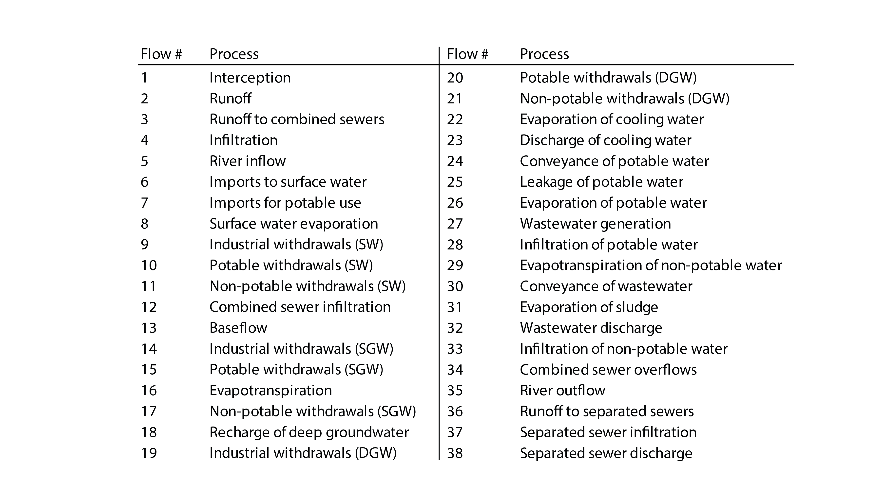

`CityWaterBalance` provides a reproducible workflow for studying urban water
systems.  Any system may be modeled with preassembled data, but data 
for US cities can be gathered via web services using this package and 
dependencies. 


## Install

Development version available on Github:

```{r eval=FALSE}
devtools::install_github("USEPA/CityWaterBalance")
```

```{r}
library("CityWaterBalance")
```

## Usage overview

`CityWaterBalance` is based on a model of the urban water system, shown in the
diagram below.  This diagram specifies the network of water flows along with
a mathematical solution for unknown flows or changes in system storages.  





## Usage examples
There are two ways to run the `CityWaterBalance` model.

### Option 1:  Input preassembled data

See `CityWaterBalance` function inputs for details.  Data should be in
self-consistent units.  Each row of data must represent the same time period.
The example below is based on the included dataset (`cwb_data`) on flows of 
water in the Chicago metropolitan area.

```{r}
# Specify parameters
p <- list("interc" = 0, "et_mult" = 1, "flow_mult" = 1, "open_wat" = 0.02,
          "run_mult" = 1, "run_css" = 0.35, "bf_mult" = 1, "nonrev" = 0.08,
          "pow_evap" = 0.012, "wast_gen" = 0.85, "pot_atm" = 0.13, 
          "npot_infilt" = 0.5, "slud_evap" = 0, "leak_css" = 0.05, "dgw" = 0.5,
          "dgw_rep" = 0.5)

# Run model
m <- CityWaterBalance(cwb_data,p, print=FALSE)
```

Output from the model includes a list of 5 zoo series with values at each 
timestep for: 1) global flows, 2) internal flows, 3) state variables (storages,
producers and consumers), 4) internal and 5) global water balances.

```{r}
# Visualize output
plotWaterBalance(m$global_flows)
```

### Option 2: Input data gathered from web services

`CityWaterBalance` has other functions that assemble data for the model.  At 
this time, these functions access US-based web services.

#### Specify spatial and temporal boundaries

Define an area of interest (AOI) and upload that geometry to the 
[USGS Geo Data Portal](https://cida.usgs.gov/gdp/) (GDP). The GDP will give the
geometry a name, which may start with 'upload:'.  Here we use a geometry that is 
already available to the GDP in order to automate the example.

```
geometry <- 'sample:Counties'
att <- 'STATE'
val <- 'RI'
area <- 2707
start <- "2010-01-01"
end <- "2010-12-31"
```

#### Get atmospheric data

```
latitude <- 41.5801
atm <- getAtmoFlows(start,end,geometry,att,val,latitude)
```

#### Get streamflow data

Choose streamgages to evaluate total inflow and outflow for the AOI.  
[NWIS mapper](https://maps.waterdata.usgs.gov/) may be useful here.

```
ingages <- c("01112500")
outgages <-c("01113895","01114000","01117000","01118500")

inflow <- getStreamflow(start,end,ingages)
outflow <- getStreamflow(start,end,outgages)
```

Look at the streamflow data with the function `plotStreamflow`.  Gaps can be 
filled using `gapfillStreamflow`.  When time series for all gages are complete, use `combineStreamflow` to aggegate total in/outflow.

#### Get water use data

Identify the states and counties in your AOI. County is the finest spatial scale 
for [USGS water use data](https://waterdata.usgs.gov/nwis/wu) served by NWIS.

```
states <- c("RI")
counties <- list(c("Providence","Kent","Bristol","Newport","Washington"))
wu <- getWaterUse(states,counties,years="ALL")
```

The above retrieves [USGS water use](https://water.usgs.gov/watuse/) data for 
the specified counties for all available years and withdrawal categories. To 
reorganize this output for use by `CityWaterBalance` use:

```
wu <- combineWaterUse(start,end,wu)
```

#### Get other data

Not all input data is currently available via web services.  These
inputs (i.e., wastewater effluent, sewer overflows, runoff, baseflow and deep 
groundwater recharge) must be gathered from other sources and converted to xts 
objects with the same temporal range and resolution as the other flows. Units 
must correspond with those specified for inputs to `mergeData`.

Finally, merge the data into a single xts of fluxes (i.e., flow/AOI) for input 
to `CityWaterBalance`.  

```
data <- mergeData(area,atm,inflow,outflow,wu)
```

### Solve

`CityWaterBalance` solves for the changes in storage of all state variables and
cumulatively, the change in global storage.  Acceptable solutions can be
determined using ancillary observations of system components (e.g., groundwater
levels). Owing to uncertainty in input data and parameters, and ancillary 
observations of system storages, acceptable solutions will vary within a 
solution space.  This space is defined by criteria for system storages.  

The function `getSolutions` tests parameter sets that satistify solution 
criteria. `getSolutions` will continue testing additional parameter sets until 
the mean flow solution differs by less than a user-specified tolerance (tol). 
Though the `CityWaterBalance` model runs quickly, running it many times to 
achieve a stable solution may take quite a while.

In `cwb_data`, the combined sewer overflow (cso) do not span the complete 
analysis period.  To compensate, this flow is set to zero and the css balance 
criteria are set to within the mean and median of the cso flow data.  Other 
criteria are set to default values. The tol is set high so the example will run 
in a reasonable amount of time.

```{r}
data <- cwb_data
data$cso <- 0
low <- median(cwb_data$cso,na.rm=TRUE)*nrow(cwb_data)
high <- mean(cwb_data$cso,na.rm=TRUE)*nrow(cwb_data)
css_crit <- c(low,high)
out <- getSolutions(data,p,100,0.02,css_bal = css_crit)
boxplot(out[,order(colMeans(out),decreasing=TRUE)],las = 2, ylab = "Flow/precip")

```


