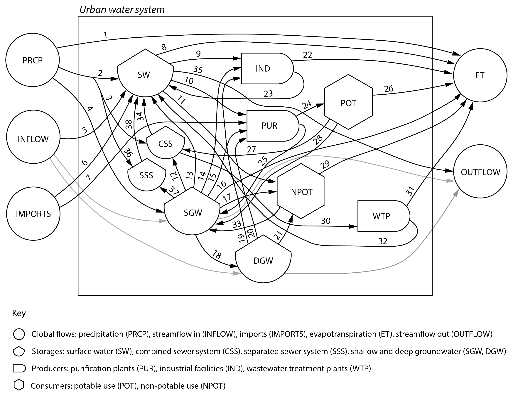

`CityWaterBalance` provides a reproducible workflow for studying an urban water
system.  The network of urban water flows and storages can be modeled and 
visualized.  Any city may be modeled with preassembled data, but data for US 
cities can be gathered via web services using this package and dependencies.  

## Install

Development version available on Github:

```{r eval=FALSE}
devtools::install_github("USEPA/CityWaterBalance")
```

```{r}
library("CityWaterBalance")
```

## Usage overview

`CityWaterBalance` is based on a model of the urban water system, shown in the
diagram below.  This diagram specifies the network for water flows along with
a mathematical solution for unknown flows or changes in storage.  




## Usage examples
There are two ways to run the CityWaterBalance model.

### Option 1:  Input preassembled data

See function inputs for details.  Data should be in
self-consistent units.  Each row of data must represent the same time period.

```{r}
# Specify parameters
p <- list("openwat"=0.02,"interc"=0,"et_amp" = 1,"flow_amp" = 1,"run_amp"=1,
          "run_css"=0.35, "baseflow_amp" = 1, "nonrev"=0.08,"powevap"=0.012,
          "wastgen"=0.85,"potatm"=0.13,"npotinfilt"=0.5,"evslud"=0,
          "css_leak"=0.05,"deepgw"=0.5,"dgwloss"=1)

# Run model
m <- CityWaterBalance(cwb_data,p, print=FALSE)
```

Output from the model includes a list of zoo series of grouped system components
(e.g. global flows).  To see the results for a group:

```{r}
# Visualize results
plotWaterBalance(m$global_flows)
```

### Option 2: Input data gathered from web services

The CityWaterBalance package has other functions that can grab and merge the 
requisite data.  At this time, these functions leverage US web services only.

#### Specify spatial and temporal boundaries

The user should define an area of interest (AOI) and upload that geometry to the 
[USGS Geo Data Portal](https://cida.usgs.gov/gdp/) (GDP). The GDP will give this
geometry a name, which may start wuth 'upload:'.  To automate this example, 
we use a geometry already available to the GDP.

```
geometry <- 'sample:Counties'
att <- 'STATE'
val <- 'RI'
area <- 3140
start <- "2015-01-01"
end <- "2015-12-31"
```

#### Get atmospheric data

```
latitude <- 41.878
atm <- getAtmoFlows(start,end,geometry,att,val,latitude)
```

#### Get streamflow data

The user should choose streamgages to evaluate total inflow and outflow for 
their AOI.  [NWIS mapper](https://maps.waterdata.usgs.gov/) may be useful here.

```
ingages <- c("05545750","05527800","05536195")
outgages <-c ("05438500","05551540","05552500","05540500","05537980")

inflow <- getStreamflow(start,end,ingages)
outflow <- getStreamflow(start,end,outgages)
```

These data may have gaps, and total in/outflow may need to estimated by 
combining data from multiple gages. For example:

```
outmult <- c(1,0.5,0.5,1,1)
outflow <- gapfillStreamflow(outflow,paired_gages)
outflow <- combineStreamflow(outflow,outmult,approx=TRUE)
```

#### Get water use data

First, identify the states and counties in your AOI. County is the finest 
spatial scale for served USGS water use data.

```
states <- c("IL")
counties <- list(c("Cook","DuPage","Kane","Kendall","Lake","McHenry","Will"))
wu <- getWaterUse(states,counties,years="ALL")
```

The above retrieves [USGS water use](https://water.usgs.gov/watuse/) data for 
the specified counties for all available years and withdrawal categories. To 
reorganize this output for use by the CityWaterBalance model, use:

```
wu = combineWaterUse(start,end,wu)
```

#### Get other data

Not all requisite data is currently available through web services.  These
inputs must be gathered from other sources and converted to xts object with the
same temporal range and resolution as the other flows.  Units for these flows 
must correspond with those specified for inputs to function mergeData.

Finally, merge these data into a single time series of fluxes (flow/AOI) for 
CityWaterBalance.  

```
data = mergeData(area,atm,inflow,outflow,sfpart=NULL,wu,ws_imports,etc_imports,wweff,dgr,cso)
```
